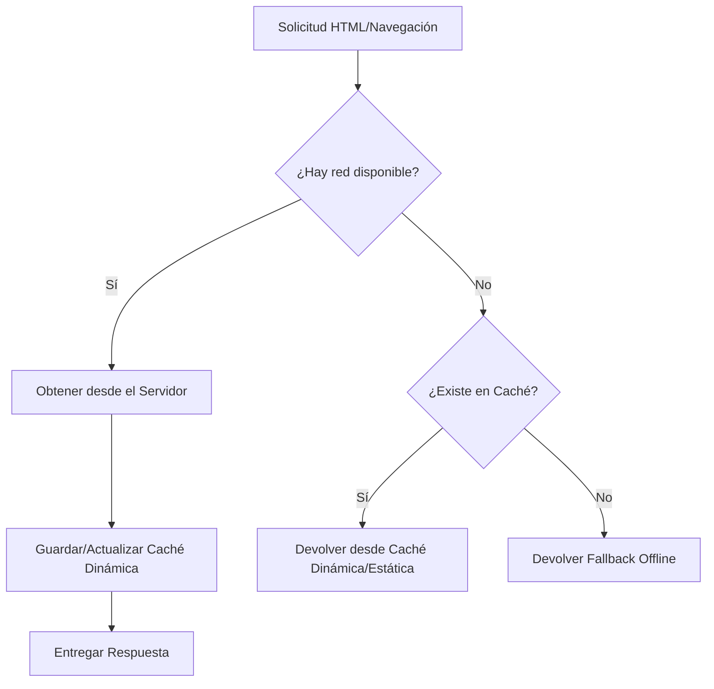
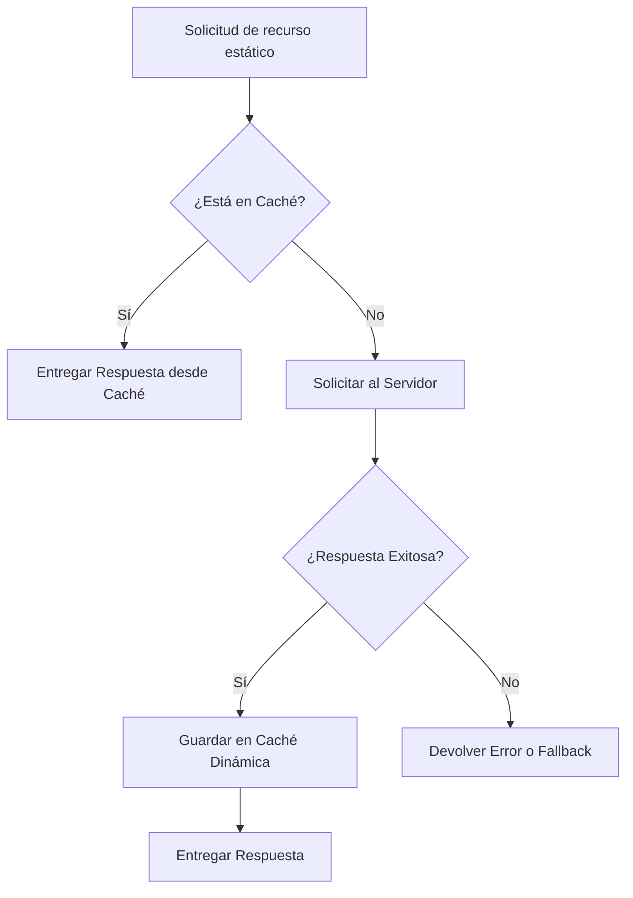

# Estrategia de Caché del Service Worker

Este documento describe las estrategias de caché implementadas en el núcleo del Service Worker (`public/sw.js`) para la aplicación PWA de inspecciones de laboratorios. El objetivo es brindar soporte para uso **offline** y garantizar un rendimiento óptimo al reducir peticiones de red innecesarias.

## 1. Instalación y Precaché (App Shell)

Durante la fase de **instalación** (`install`), el Service Worker descarga y almacena los recursos mínimos necesarios para que la aplicación muestre la estructura básica (App Shell) incluso sin conexión a internet.

- **Caché estática:** `pwa-static-v1`
- **Recursos precacheados:** `/`, `/manifest.webmanifest`.

## 2. Activación y Limpieza

Durante la fase de **activación** (`activate`), el Service Worker realiza una limpieza sistemática eliminando las cachés obsoletas que no coinciden con los nombres actuales (`pwa-static-v1` y `pwa-dynamic-v1`). Esto evita que el dispositivo del usuario acumule datos basura o versiones corruptas de la aplicación.

## 3. Estrategias de Fetch (Intercepción)

Al interceptar peticiones de red (`fetch`), el Service Worker aplica diferentes estrategias según el tipo de recurso solicitado. Solo se interceptan métodos `GET`.

### 3.1 Network First (Primero Red, Fallback a Caché)

**Aplicado a:** Navegación (HTML).

Esta estrategia es ideal para contenido que se actualiza. Priorizamos siempre traer la versión más fresca del servidor.
- **Flujo:** Intenta obtener el recurso de la red. Si tiene éxito, actualiza la caché dinámica.
- **Fallo:** Si la red falla (offline), el Service Worker intercepta la excepción y busca en la caché local para devolver la última versión guardada. Si tampoco está en caché, devuelve una página fallback por defecto.

### 3.2 Cache First (Primero Caché, Fallback a Red)

**Aplicado a:** Recursos estáticos (Imágenes, CSS, JS).

Dado que los archivos estáticos no cambian con cada visita, buscamos servirlos de manera instantánea desde el almacenamiento local.
- **Flujo:** Busca primero en la caché local. Si el archivo existe, se entrega inmediatamente sin tocar la red.
- **Fallo (Cache Miss):** Si no existe en caché, entonces realiza la petición al servidor. Si la petición es exitosa (HTTP 200 y no opaca), el recurso es guardado en la caché dinámica para futuras solicitudes.

